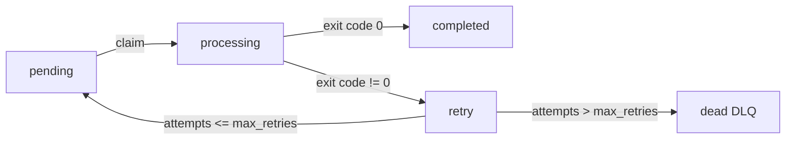
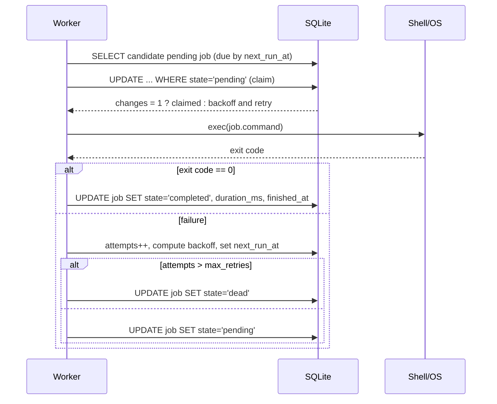

# DESIGN.md — Architecture & Design Overview for `queuectl`

This document explains the architecture, core flows, data model, and design trade-offs of **queuectl**, a CLI-driven background job queue built in Node.js with SQLite persistence.

---

## 1) Goals & Non-Goals

**Goals**
- Durable background job execution with **retries, exponential backoff, and DLQ**.
- **Multiple workers** executing jobs in parallel without duplicate processing.
- **Simple, observable** system with a clean CLI and basic **metrics**.
- **Zero external infra** (single binary + SQLite file).

**Non-Goals**
- Multi-node clustering / distributed locks.
- Advanced scheduling/cron or recurring jobs.
- Complex priority hierarchies or fair scheduling across queues.

---

## 2) High-Level Architecture
```text
+-------------------+         +---------------------+
|      CLI (Node)   |  --->   |   SQLite (queue.db) |
+-------------------+         +---------------------+
          |                              ^
          v                              |
+-------------------+   claim/update   +-----------------+
|  Worker Manager   | ---------------> |    Jobs Table   |
| (start/stop,PIDs) | <--------------- |   Config Table  |
+-------------------+    list/status   |   (meta table)  |
          |                              +-----------------+
          v
+-------------------+
|  Worker Process   | --> exec(cmd) --> child_process.exec
|   (N processes)   |
+-------------------+
```

- **CLI** orchestrates everything: enqueue jobs, start/stop workers, view status/DLQ, manage config, show metrics.
- **SQLite** is the single source of truth (ACID, WAL mode).
- **Workers** poll, atomically claim one pending job, execute it, and update state.

---

## 3) Data Model (SQLite)

### Tables

```sql
-- jobs: core queue table
CREATE TABLE jobs (
  id TEXT PRIMARY KEY,
  command TEXT NOT NULL,
  state TEXT NOT NULL DEFAULT 'pending',      -- pending | processing | completed | dead
  attempts INTEGER NOT NULL DEFAULT 0,
  max_retries INTEGER NOT NULL DEFAULT 3,
  priority INTEGER DEFAULT 0,
  next_run_at TEXT,                           -- schedule & backoff
  created_at TEXT NOT NULL,
  updated_at TEXT NOT NULL,
  locked_by TEXT,                             -- worker id (pid)
  locked_at TEXT,
  started_at TEXT,
  finished_at TEXT,
  duration_ms INTEGER
);

-- config: runtime-configurable settings
CREATE TABLE config (
  key TEXT PRIMARY KEY,
  value TEXT
);

-- meta: reserved for future migrations
CREATE TABLE meta (
  k TEXT PRIMARY KEY,
  v TEXT
);
```
# Important fields

-```state```: pending → processing → completed or dead (DLQ).

-```attempts```: incremented on failure; once ```attempts > max_retries``` → ```dead```.

-```priority```: higher runs first; ordering is ```priority DESC, created_at ASC```.

-```next_run_at```: used for delayed jobs and exponential backoff scheduling.

-```started_at```, ```finished_at```, ```duration_ms```: execution timing & metrics.

# 4) Job Lifecycle



Backoff formula:
```delay_seconds = backoff_base ^ attempts```
```backoff_base``` is configurable via CLI (default: 2).

# 5) Concurrency, Locking & No-Duplicates

Atomic Claim (single UPDATE wins):

1. Worker selects a candidate job id:
```
SELECT id FROM jobs
WHERE state='pending' AND (next_run_at IS NULL OR next_run_at <= ?)
ORDER BY priority DESC, created_at
LIMIT 1;
```

2. Worker attempts to atomically claim it:
```
UPDATE jobs
  SET state='processing', locked_by=?, locked_at=?, started_at=?, updated_at=?
WHERE id=? AND state='pending';
```

3. If ```changes == 1``` → claim succeeded; otherwise another worker won.

Why this works
SQLite provides transactional guarantees; the UPDATE with state check prevents two workers from processing the same job.
---
# 6) Worker Execution Flow




**Graceful shutdown**
Workers catch SIGTERM, set a flag, finish the current job, and then exit.
---
# 7) Configuration

Stored in the ```config``` table; editable via CLI:

-```backoff_base``` (default ```2```)

-```default_max_retries``` (default ```3```)
```
queuectl config set backoff_base 3
queuectl config list
```

Workers read config on demand to avoid restarts for most changes.
---
# 8) Metrics & Observability

-Duration tracking: ```started_at```, ```finished_at```, ```duration_ms``` captured per job.

-CLI metrics: ```queuectl metrics``` prints:

 -counts by ```state```

 -completed job durations: avg/min/max

 -overall totals and average attempts

-Easy to extend with:

 -per-job stdout/stderr logs

 -timeseries snapshots in a new ```metrics``` table
---
# 9) Failure Modes & Recovery

-** Worker crash **: on next boot, any job left processing can be handled by:

  -allowing a watchdog that reverts stale processing → pending (not implemented, optional extension).

-** Command not found or non-zero exit **: triggers retry & backoff; may go to DLQ.

-** DB corruption **: SQLite WAL reduces risk; backup strategy is recommended for production.
---
# 10) Security Notes

-Commands are executed by the OS shell (```exec```); treat inputs as trusted in this educational context.

-For real production, sanitize inputs, use allow-lists, or run commands in isolated sandboxes/containers.
---
# 11) Scaling & Future Work

**Horizontal scaling (future)**

-For multi-node workers, you’d need a central DB (Postgres) and stronger locking (e.g., SKIP LOCKED pattern or advisory locks).

** Possible enhancements **

- Job timeouts (per-job, kill child process on exceed).

- Recurring schedules / CRON.

- Web dashboard (Express + table view).

- Output logging to ```data/logs/<jobId>.out/.err```.

- Stale ```processing``` job reaper.
---
# 12) Key Trade-offs

- ** SQLite **: Simple, reliable, single-node; not ideal for multi-node clustering.

- ** Polling workers ** : Simpler than push or notifications; slightly higher idle overhead.

- ** Single queue **: One table; easy to extend to multiple named queues via an extra column.


---

## 📌 Where to put it & how to commit

From your repo root:

```bash
# create file
printf "%s\n" "$(cat <<'EOF'
<PASTE THE DESIGN.md CONTENT FROM ABOVE HERE>
EOF
)" > DESIGN.md

# commit with a clear message
git add DESIGN.md
git commit -m "docs: add DESIGN.md with architecture, flows, data model, and trade-offs"
git push
